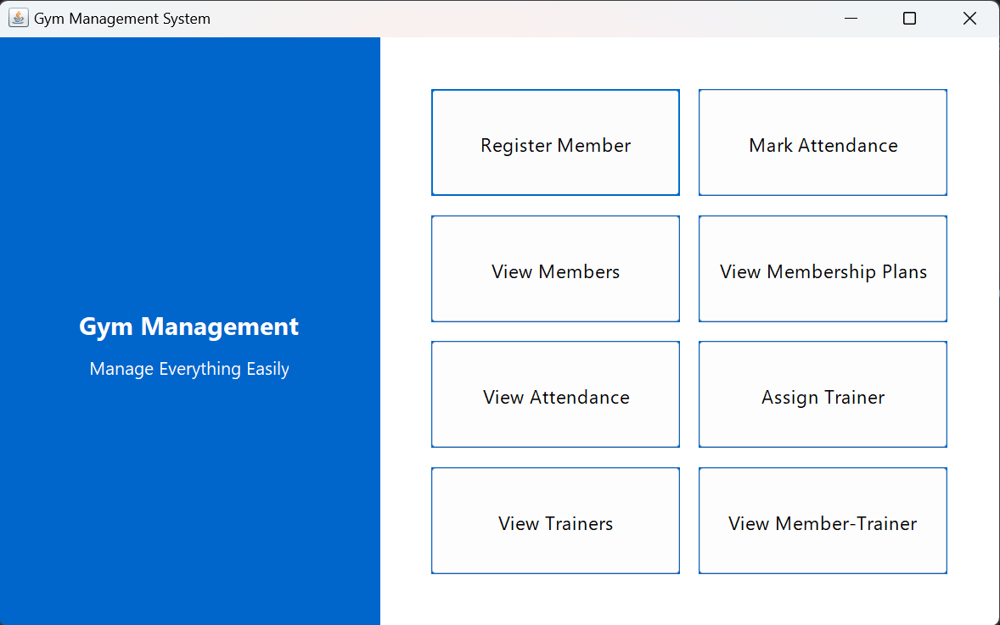

# GymManagement
A desktop-based gym management application built with Java Swing and PostgreSQL. It allows gym owners to register members, assign plans, track attendance, and manage trainers through an interactive GUI.

## Features
- Member Registration & Management  
- Trainer Assignment  
- Attendance Tracking  
- Membership Plans  
- PostgreSQL Database Integration (via JDBC)

- ## Tech Stack
- Java (Swing for GUI)
- PostgreSQL
- JDBC
- IntelliJ IDEA

## Getting Started
1. Clone the repository  
   `git clone https://github.com/SanyamB9187/gym-management-system.git`

2. Import into IntelliJ IDEA or your preferred IDE  
3. Set up the PostgreSQL database (SQL schema provided in the files starting with name 'postgre')  
4. Run `Main.java`
   
## Screenshots

